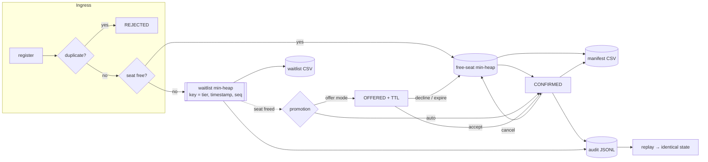

<div align="center">

# 🪑 Automated Event Seat Allocation Engine

**A dependency-free Python engine that manages event waitlists and seat caps with binary heaps, and exports auditable attendee manifests to CSV.**

[](#testing-strategy)
[](#quickstart)
[](#quickstart)
[](LICENSE)

*Built for the SoarJMI Technical Team — Programming & DSA task.*

</div>

---

## The problem

Every event with a seat cap eventually hits the same four questions:

1. **Who gets the last seat?** Registration requests arrive as an unordered stream; the answer must be *deterministic*, *fair*, and *explainable* after the fact.
2. **What happens when someone cancels?** A freed seat must go to the next eligible person **immediately** — minutes of lag is literally an empty chair at a sold-out event ([InEvent on waitlist management](https://inevent.com/en/products/event-waitlist-management-software.php), [Luma's guidance to "monitor no-shows"](https://help.luma.com/p/waitlist)).
3. **How do you avoid double-booking?** Two attendees must never hold the same seat, even if a cancellation and a registration interleave.
4. **How do you prove it later?** When someone disputes "why did *he* get in and not *me*?", the answer needs to be reproducible, not a shrug.

This engine answers all four with a small, well-tested core built on the right data structures:

| Question | Mechanism | Cost |
|---|---|---|
| Who is next in line? | Binary **min-heap** keyed on `(tier_weight, registered_at, arrival_sequence)` | `O(log n)` |
| Someone cancelled mid-queue | **Lazy deletion (tombstone)** + entry index | `O(1)` delete, `O(log n)` amortised pop |
| Which seat number is free? | Second min-heap over the seat-number pool | `O(log n)` |
| Explain the decision | Append-only **JSONL audit log** + deterministic replay | `O(1)` write per event |

**Zero runtime dependencies** — standard library only. No database, no server, no `pandas`.

---

## Quickstart

```bash
git clone https://github.com/4yushman/seatalloc.git
cd seatalloc
pip install -e ".[dev]"          # or: export PYTHONPATH=src

python -m seatalloc demo          # 60-second guided walkthrough, deterministic
python -m pytest -q               # 99 tests (property-based + stateful + empirical)
python -m seatalloc bench         # regenerate docs/BENCHMARKS.md
```

### As a library

```python
from seatalloc import Attendee, EventConfig, SeatAllocationEngine, export_manifest

config = EventConfig(event_id="DEVX26", name="DevXJMI 2026", capacity=2)
engine = SeatAllocationEngine(config)

a = engine.register(Attendee("A1", "Ayesha", "ayesha@example.com", "MEMBER"), registered_at=100.0)
b = engine.register(Attendee("A2", "Bilal",  "bilal@example.com",  "GENERAL"), registered_at=101.0)
c = engine.register(Attendee("A3", "Charan", "charan@example.com", "GENERAL"), registered_at=102.0)

c.status.value            # 'WAITLISTED'   (event is full)
engine.cancel(a.reg_id, at=103.0)
c.status.value            # 'CONFIRMED'    (promoted automatically — no seat sat idle)
c.seat_number             # 1              (the recycled seat, lowest-first)

export_manifest(engine, "devx26_manifest.csv", at=110.0)
```

### Highlights of the API

```python
engine.register(attendee, registered_at=...)     # raises on duplicate / closed window / full queue
engine.try_register(attendee, registered_at=...) # returns (reg | None, reason) — safe for bulk imports
engine.cancel(reg_id, at=...)                    # idempotent; promotes the next person
engine.accept_offer(reg_id, at=...)              # OFFER-mode promotion -> CONFIRMED
engine.decline_offer(reg_id, at=...)             # seat passed on
engine.expire_offers(at=...)                     # TTL sweep: recycle seats nobody claimed
engine.reinstate(reg_id, at=...)                 # undo a cancellation, keeping queue seniority
engine.set_capacity(90, at=...)                  # grow → auto-promote; shrink → refuse to evict
engine.waitlist()                                # queue in promotion order
engine.waitlist_position(reg_id)                 # "you are #7"
engine.confirmed_seats()                         # [(seat, reg_id), ...] — the allocator's output
engine.stats()                                   # fill rate, promos, avg wait, tombstone debt
engine.reconcile()                               # self-audit: [] means every invariant holds
```

### CLI

```bash
# Deterministic demo: arrivals, waitlist, cancellation → promotion, capacity bump, exports
python -m seatalloc demo --capacity 4 --mode offer --out examples/demo

# Synthetic load test: 5,000 registrations, 10% cancellations, capacity growth, all exports
python -m seatalloc simulate --attendees 5000 --capacity 1000 --cancel-rate 0.1 --grow-capacity 1.5

# Ingest a registrations CSV (attendee_id,name,email,tier,registered_at) and emit the manifest
python -m seatalloc import-csv data/sample_registrations.csv --capacity 25 --out out/

# Rebuild the event from its audit log and prove the manifest is reproducible
python -m seatalloc verify examples/demo/devx26_audit.jsonl

# Operational snapshot + next-in-line list, from the log alone
python -m seatalloc stats examples/demo/devx26_audit.jsonl --limit 5
```

---

## Architecture



| Module | Responsibility |
|---|---|
| `engine.py` | The allocator: state machine, promotion logic, invariants, `reconcile()` |
| `priority.py` | `LazyDeletionHeap` — heap with `O(1)` deletion by key (tombstones) |
| `models.py` | Domain types: `Attendee`, `Registration`, `RegistrationStatus`, `EventConfig`, errors |
| `csv_export.py` | Manifest / waitlist / audit / summary CSVs + SHA-256 fingerprint |
| `persistence.py` | Append-only JSONL log, event sourcing, deterministic `replay()` |
| `reference.py` | Deliberately naive list-based model → **test oracle** and **benchmark baseline** |
| `benchmarks.py` | Empirical complexity harness → `docs/BENCHMARKS.md` |
| `cli.py` | `demo`, `simulate`, `import-csv`, `verify`, `stats`, `export`, `bench` |

---

## Time-complexity analysis

Let **n** = registrations ever recorded, **q** = current waitlist depth, **c** = capacity.
Every status change is funnelled through one method (`_transition`), which maintains running counters — that single design decision is what keeps the hot paths logarithmic instead of accidentally linear.

### Theoretical

| Operation | Time | Space | Why |
|---|---|---|---|
| `register` (seat free) | **O(log c)** | O(1) | `heappop` from the seat-number pool |
| `register` (full → waitlist) | **O(log q)** | O(1) | `heappush` onto the waitlist heap |
| `cancel` | **O(log c)** | O(1) | `O(1)` tombstone + one promotion (`heappop` + `heappush`) |
| promotion (`accept_offer`) | **O(1)** | O(1) | status flip; the seat was already held |
| `expire_offers` sweep | O(o log c) | O(1) | `o` = outstanding offers (`o ≤ c`) |
| `set_capacity` | O(Δ log c + k log q) | O(Δ) | Δ = growth, `k` = people promoted |
| `held_seats()` / `open_seats()` | **O(1)** | O(1) | running counters, not a scan |
| `confirmed_seats()` | O(c log c) | O(c) | sort by seat number |
| `waitlist()` (ordered) | O(q log q) | O(q) | a heap yields the *minimum* in `O(log q)`, a full *ordering* in `O(q log q)` |
| `waitlist_position(id)` | O(q) | O(1) | counting scan; **rank is not a heap primitive** |
| `export_manifest` | O(n log n) | O(c) | sort + streamed rows |
| `reconcile()` | O(n log n) | O(n) | full audit — an offline tool, not a hot path |
| `replay(log)` | O(n log n) | O(n) | re-applies n events |
| Build engine | **O(c)** | O(c) | one `heapify`, not c pushes |

**Contrast with the obvious alternatives**

| Structure | insert | promote next | delete from middle | Verdict |
|---|---|---|---|---|
| Sorted list (`bisect.insort`) | O(n) | O(1) | O(n) | insert is the common case — bad |
| List + `sorted()` on each promotion (`reference.py`) | O(n log n) | O(n log n) | O(n log n) | simple, obviously correct… and 76-131x slower |
| `heapq` + `list.remove` + `heapify` | O(log n) | O(log n) | **O(n)** | the classic mistake (see benchmark 2) |
| **Heap + lazy deletion (this repo)** | **O(log n)** | **O(log n)** | **O(1)** | ✅ |

### Empirical (measured, reproducible)

From [`docs/BENCHMARKS.md`](docs/BENCHMARKS.md) (`python -m seatalloc bench`, Python 3.13, min of repeated runs after a discarded warm-up):

| Event size | `register` | `cancel + promote` | `rank query` (worst case) | `export manifest` |
|---|---|---|---|---|
| 1,000 | 7.6 µs | 6.5 µs | 65 µs | 5.4 µs/row |
| 10,000 | 10.1 µs | 8.2 µs | 588 µs | 5.0 µs/row |
| 100,000 | 15.4 µs | 18.6 µs | 6.4 ms | 6.8 µs/row |
| **growth (100k / 1k)** | **2.0x** | **2.8x** | **98x** | **1.27x** |
| **log-log exponent** | **+0.15** | **+0.23** | **+1.00** | **+0.05** |
| **matches** | `O(log n)` | `O(log n)` | `O(n)` | `O(1)` per row |

> For a 100x input increase, `O(1)` predicts 1x, `O(log n)` ~1.7x, `O(n)` 100x. The
> registration and promotion columns grow 2-3x while a linear implementation would grow
> 100x — and the exponent is a direct measurement of the underlying curve, not a curve fit
> we hope is right.

| Head-to-head workload | Heap engine | Naive list model | Speed-up |
|---|---|---|---|
| 4,000 registrations + 400 cancellations | 59.5 ms | 4,536 ms | **76x** |
| 1,000 deletions from a 50,000-entry queue | 54.9 ms | 7,228 ms | **132x** |
| Build a 200,000-element heap (`heapify` vs n × `heappush`) | 47.2 ms | 60.1 ms | **1.3x** |

Two of these were **found by this repo's own tooling**, and both are the kind of bug that
only shows up at scale:

* `held_seats()` originally recomputed `len([r for r in registrations if r.holds_seat])` — an `O(n)` scan on *every* registration. The growth-ratio test in `tests/test_complexity.py` failed, and the fix (a maintained counter + a single `_transition` choke point) turned 100k registrations from minutes into 1.6 s.
* `waitlist_position()` originally drained a copy of the heap (`O(k log k)`, 130 ms at n=100k). Replaced with an `O(n)` counting scan that allocates nothing → **6.4 ms**, a 20x improvement.

### Rank queries: the honest trade-off

A binary heap gives you the minimum in `O(1)`/`O(log n)` but **cannot report "you are number 47" cheaply** — the array is only partially ordered. Three options were considered:

| Option | Insert | Rank query | Verdict |
|---|---|---|---|
| Maintain a position on every entry | **O(n)** | O(1) | unacceptable: insertion is the hot path |
| Drain a scratch copy of the heap | O(log n) | O(k log k) | measured 130 ms @ n=100k — rejected |
| **Counting scan on demand (shipped)** | O(log n) | **O(n)**, O(1) space | ✅ 6.4 ms @ n=100k |
| Fenwick tree over sequence numbers / balanced tree | O(log n) | O(log n) | the right upgrade *if* rank ever becomes hot — listed in future work |

To avoid paying even the scan, the engine records `queue_size_at_registration` (a free `len()` at arrival) and exports/UI use one `waitlist()` sort instead of n rank queries.

---

## Correctness: the invariants

Enforced in code and checked by `engine.reconcile()` (and by the property tests after **every** generated operation):

| # | Invariant |
|---|---|
| **I1** | `held_seats ≤ capacity` — never oversell, not even transiently |
| **I2** | every held registration has `1 ≤ seat_number ≤ capacity` |
| **I3** | seat numbers are unique among held registrations |
| **I4** | the waitlist heap contains exactly the `WAITLISTED` registrations |
| **I5** | promotion order == sort by `(tier_weight, registered_at, sequence)` |
| **I6** | an attendee never has two active registrations |

`reconcile()` also detects **seat-pool drift** — it caught a real bug during development where post-event states (`ATTENDED`, `NO_SHOW`) were not counted as holding their seat, which would have let a finished event promote someone off the waitlist.

### Fairness is a total order, not a heuristic

`(tier_weight, registered_at, arrival_sequence)` — lower wins:

* **tier first** → organisers/volunteers/speakers/members ahead of general attendees (`EventConfig.tier_weights`);
* **then timestamp** → strict FIFO inside a tier;
* **then sequence** → two requests with the *identical* timestamp still resolve deterministically, because heaps are **not** stable. This is why the order is total and why the manifest is byte-identical across runs.

### Determinism & auditability

* Every public method accepts an explicit `at` timestamp → no wall-clock dependence, so tests, simulations and replays are reproducible.
* Every state change emits one JSONL event; `replay()` rebuilds the engine from the log and reproduces a **byte-identical manifest** (verified by SHA-256 in `manifest_fingerprint()`).
* `reconcile()` + fingerprint = "publish this next to the CSV" so a disputed manifest can be regenerated, not argued about.

---

## CSV deliverables

| File | Contents |
|---|---|
| `<event>_manifest.csv` | seat_number, reg_id, attendee_id, name, email, tier, status, registered_at_utc, confirmed_at_utc, wait_seconds, promoted_from_waitlist, queue_size_at_registration, note |
| `<event>_waitlist.csv` | queue_position, reg_id, name, email, tier, priority_weight, registered_at_utc, waiting_seconds |
| `<event>_audit.csv` | every registration ever seen, including CANCELLED / EXPIRED / REJECTED |
| `<event>_summary.csv` | one dashboard row: capacity, confirmed, waitlisted, fill_rate, promotions, avg/max wait |
| `<event>_audit.jsonl` | the replayable event log (source of truth) |

Written with the standard `csv` module: UTF-8 (accented names survive), CRLF terminators (Excel-friendly), `newline=""` (no blank-line corruption).

---

## Testing strategy

```
99 tests · pytest · hypothesis · no network · no fixtures beyond tmp_path
├── test_priority_heap.py   (12)  heap semantics + equivalence with heapq under random ops
├── test_engine.py          (35)  every business rule, one test per promise
├── test_properties.py       (9)  Hypothesis: invariants over hundreds of random op sequences
├── test_stateful.py         (2)  RuleBasedStateMachine: engine vs naive oracle, step by step
├── test_csv_export.py      (18)  exact headers, ordering, UTF-8, quoting, byte-identical reruns
├── test_persistence.py     (15)  log format, replay equivalence, corrupt/truncated logs
└── test_complexity.py       (8)  empirical growth ratios + heapify vs push-loop (mark: slow)
```

* **Example-based tests** pin the rules (`test_engine.py` — one test per business promise).
* **Property-based tests** (`hypothesis`) assert invariants across hundreds of generated operation sequences, including hostile ones: duplicate registrations, cancellations of already-cancelled people, capacity raises mid-flight, identical timestamps, tiers that jump the queue.
* **Model-based/stateful tests** run the fast engine *and* the deliberately naive list model side by side and assert they agree seat-for-seat after every step — when they disagree, Hypothesis shrinks the sequence to the shortest reproducer.
* **Empirical complexity tests** assert *growth ratios*, not milliseconds, so they are robust on slow CI machines yet still fail loudly if a hot path degrades to `O(n)` (which is exactly how the `held_seats()` bug was caught).
* Everything runs offline in under 30 seconds (`pytest -m "not slow"` for ~5 s).

---

## Design decisions & trade-offs

| Decision | Alternative | Why this way |
|---|---|---|
| Lazy deletion (tombstones) | `heap.remove` + `heapify` | `O(1)` deletion vs `O(n)`; trade-off is O(#cancellations) extra slots, exposed as the `tombstone_debt` metric and reclaimed by `compact()` |
| Explicit seat numbers, never renumbered | renumber after cancellations | an attendee's seat is printed on their pass; gaps are the honest artifact of churn |
| `set_capacity` refuses to shrink below held seats | auto-cancel the excess | "capacity typo silently cancels 20 confirmed attendees" is not a failure mode anyone wants; the caller must cancel explicitly |
| Post-event states still hold their seat | free the seat on check-in | otherwise a finished event promotes people off the waitlist and the seat-pool audit drifts |
| `cancel()` is idempotent (returns `False`) | raise on double-cancel | double-clicked buttons and retried webhooks are normal; a second cancel must never promote a second person |
| Promote on both cancel **and** expiry, in one call | separate background job | a seat is never stranded while the queue is non-empty (asserted as a stateful invariant) |
| Offer mode with TTL | always auto-confirm | mirrors real platforms ("claim your spot within X minutes"), and keeps seats working when people ignore notifications |
| Append-only JSONL log | mutable DB rows | an allocator decision must be explainable months later; JSONL survives being copied anywhere |
| Zero runtime dependencies | `pandas`/`SQLAlchemy`/`redis` | deployable inside a cron job, a Lambda, or a WhatsApp-bot backend with `pip install` avoided entirely |
| Deterministic replay instead of snapshots | pickled state | replay *proves* the rules were applied; a snapshot only shows the outcome |

---

## Limitations & future work

* **Single-process** — the engine is in-memory and not thread-safe; correctness under true concurrency needs a lock or an actor per event. (The lock-free path is a `SELECT … FOR UPDATE`/Redis `SETNX` style seat reservation at the API layer.)
* **No payments/refunds, no ticket types, no venue seat maps** — out of scope for the task; the seat pool is a single number.
* **Rank queries are `O(n)`** — upgrade to a Fenwick tree / order-statistics tree if "your position" becomes a hot path.
* **Tombstone debt is bounded by cancellations, not time** — call `LazyDeletionHeap.compact()` (or a periodic job) for very long-lived queues.
* **Group reservations** (`4 seats together`) would need a quantity dimension on both heaps.
* **No-shows**: the engine records them (`mark_no_show`) but does not yet learn an over-booking ratio from historical no-show rates — a natural next step for a data-driven capacity recommendation.

Roadmap ideas: FastAPI wrapper + webhook `POST /events/{id}/cancel`, SQLite/Postgres-backed event store, Prometheus metrics for queue depth and tombstone debt, an aging term so very old waitlisted attendees outrank fresh high-tier arrivals.

---

## Project layout

```
seatalloc/
├── src/seatalloc/        # library (zero deps)
├── tests/                # 99 tests: unit + property + stateful + empirical
├── docs/
│   ├── DESIGN.md         # requirements, alternatives, trade-offs, failure modes
│   ├── COMPLEXITY.md     # full derivations + rank-query discussion
│   └── BENCHMARKS.md     # generated by `make bench`
├── benchmarks/results.json
├── examples/demo/        # committed demo output (CSVs + audit log)
├── data/sample_registrations.csv
├── Makefile · pyproject.toml · .github/workflows/ci.yml
```

## References

* CPython docs — [`heapq`](https://docs.python.org/3/library/heapq.html), including the *Priority Queue Implementation Notes* this module's lazy-deletion pattern follows.
* [Real Python — The `heapq` Module: Using Heaps and Priority Queues](https://realpython.com/python-heapq-module/)
* [InEvent — Event waitlist management: automatic promotion, acceptance windows, fallback logic](https://inevent.com/en/products/event-waitlist-management-software.php)
* [Luma — Event capacity & over-capacity waitlists](https://help.luma.com/p/waitlist)
* [Queue-it — why FIFO alone isn't always the fairest queue](https://queue-it.com/blog/first-in-first-out-randomization/)
* [Workmate — scaling FIFO intake with priority aging and bounded queues](https://www.workmate.com/blog/scaling-fifo-for-work-intake-design-first-in-first-out-queues-to-fairly-manage-requests)
* [Hypothesis — stateful testing with `RuleBasedStateMachine`](https://hypothesis.readthedocs.io/en/latest/stateful.html)

## License

MIT — see [LICENSE](LICENSE).
